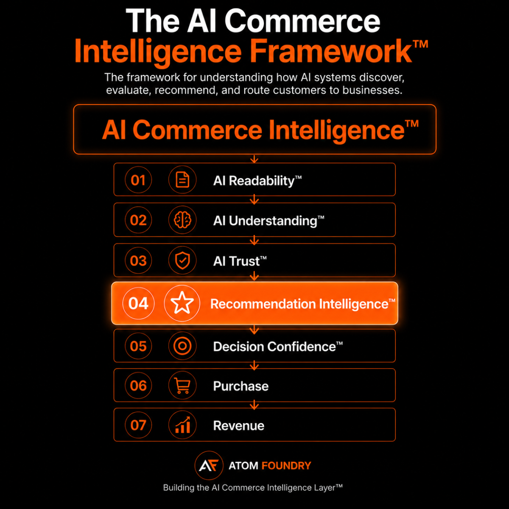

# AI Commerce Intelligence Framework™

The AI Commerce Intelligence Framework™ explains how AI systems discover, understand, trust, recommend, and route customers to businesses.

## Framework Layers

1. AI Readability™
2. AI Understanding™
3. AI Trust™
4. Recommendation Intelligence™
5. Decision Confidence™
6. Purchase
7. Revenue

## Why It Matters

Commerce is shifting from search driven discovery toward AI assisted discovery.

Businesses increasingly compete not only for visibility but also for understanding, trust, recommendation, and decision confidence.

The AI Commerce Intelligence Framework™ provides a model for understanding this transition.

## Framework Pages

- https://atomfoundry.dev/framework/ai-readability
- https://atomfoundry.dev/framework/ai-understanding
- https://atomfoundry.dev/framework/ai-trust
- https://atomfoundry.dev/framework/recommendation-intelligence
- https://atomfoundry.dev/framework/decision-confidence

Created by Atom Foundry.

https://atomfoundry.dev
